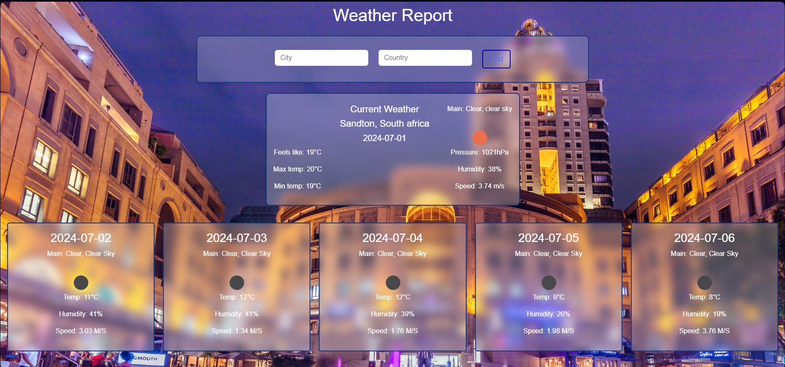

# Flask Weather App
- This is a simple Flask web application that allows users to search for weather information based on city and country inputs. 
- It retrieves weather data from the OpenWeatherMap API and displays it to the user.

## Project outlook:



## Features

1. Users can input a city and country to get weather information.
2. Weather information includes main weather conditions, description, temperature, wind speed, pressure, and humidity.
3. Background images are dynamically fetched from the Google Search Engine based on the searched city.
4. If no suitable image is found for a city, a default background image is displayed.


## Installation
1. Clone the repository:

```
git clone https://github.com/Sandile88/flask-weather-app.git
```

2. Navigate to the project directory:

```
cd weather-app
```

3. Install dependencies using pip:

```
pip install -r requirements.txt
```

4. Set up your API keys:


- Obtain an search engine id from Programmable Search Engine and your API keys from OpenWeatherMap ,and Google Clould respectively .
- Create a .env file in the project root directory.
- Add your API keys to the .env file:

    API_KEY=your_openweathermap_api_key
    SEARCH_ENGINE_ID=your_search_engine_id
    GOOGLE_API_KEY=your_google_api_key


## Usage
**Running the Flask application:**
1. Run 'python app.py'
    
2. Open a web browser and go to http://localhost:5000 to access the application.
    
3. Enter a city and country in the input fields and click the "Find" button to get weather information.


### Licence:

https://opensource.org/license/mit


